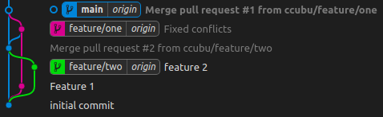

# merge


- Developer 1 codes feature one
``` 
 git checkout -b feature/one
 git add .
 touch code.txt
 echo feature 1 >> code.txt
 git add .
 git commit -m "Feature 1"
 git push origin feature/one
```

- Developer 1 creates PR1

- Developer 2 codes feature two
``` 
git checkout -b feature/two
echo feature 2 >> code.txt
git add .
git commit -m"feature 2"
git push origin feature/two
```

- Developer 2 creates PR2

- PR2 gets merged

- Developer 1 has to fix conflicts: 

``` // Developer 1
git checkout main
git pull origin main
git checkout feature/one
git merge main
// Fix conflicts
git commit -m "Fixed conflicts"
git push -u origin feature/one
```

- PR1 gets merged

## Result:

